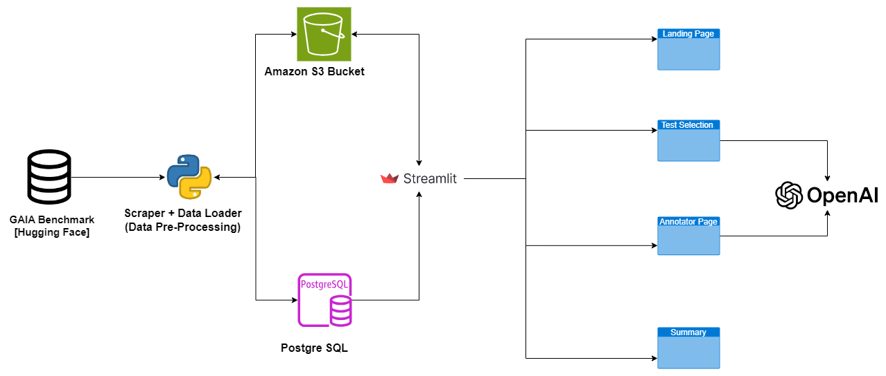

# GAIA-ToolBench

## Introduction
- This project develops a tool using Streamlit to help the Model Evaluation Team select and validate test cases from the GAIA dataset and evaluate the OpenAI model against them. Users can interactively assess the model's performance and provide feedback.
- Link to working application, deployed on streamlit cloud: https://damg7245-a2-assign1.streamlit.app/
- Link to the Video: [ScreencastRecording](video/streamlit-app-2024-09-27-15-09-08.mp4)
- Link to the codelab documentation: https://codelabs-preview.appspot.com/?file_id=1lcpMMFA4Ow_vjpujuo2os8GiATqQlcYVz_xSgF04Hpo#0
  
## Setup
- Poetry:
  - Install poetry using this: https://python-poetry.org/docs/#installation
- Once poetry is installed, run `poetry install` and validate the installed packages through `poetry show`
- Create a new `.env` file from `.env.template` and populate it with your tokens & credentials
- Run the command `poetry self add poetry-dotenv-plugin` to install the dotenv plugin for poetry. It will allow running any python without having to reload the shell with the .env variables.

## How to Run
- Clone this repository.
- Install dependencies
- Run the Streamlit app: streamlit run app.py
- Optionally you could use docker to run the app. Use the command `docker build -t streamlit .`


## Components
- architecture diagram
  



```
.
├── README.md
├── app.py
├── architecture
│   ├── Assignment1-Diagram1.drawio.drawio
│   ├── Assignment1-Diagram1.drawio.png
│   ├── OpenAI_Logo.svg.png
│   ├── __init__.py
│   ├── diagrams
│   │   ├── draft1.png
│   │   └── draft2.png
│   ├── generate_diagrams.py
│   └── streamlit-logo-primary-colormark-darktext.png
├── dataset_setup
│   ├── __init__.py
│   ├── data_loader.py
│   ├── download_attachments.py
│   ├── scraper.py
│   └── upload_attachments.py
├── manage.py
├── models
│   ├── __init__.py
│   ├── benchmark_results.py
│   ├── db.py
│   └── test_cases.py
├── pages
│   ├── home.py
│   ├── reports.py
│   └── test_case.py
├── poetry.lock
├── pyproject.toml
├── tests
│   ├── test_file_system_utils.py
│   └── test_openai_utils.py
└── utils
    ├── file_system_utils.py
    └── openai_utils.py
```

## Technologies
- Streamlit: User interface for test case selection and evaluation.
- OpenAI API: Generates responses based on selected test cases.
- GAIA Dataset: Source of validation test cases.

## Key Features
- Select and submit test cases.
- Evaluate OpenAI model responses.
- Provide feedback for improvement.

## Team Members:
- Pranali Chipkar
- Gopi Krishna Gorle
- Mubin Modi

